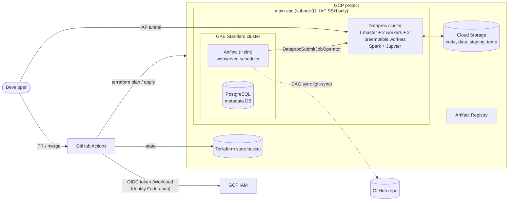

# GCP Big Data Platform (Terraform)

Infrastructure as Code for a small big-data environment on Google Cloud: Dataproc (Spark, Jupyter), Airflow on GKE, a private VPC, and a keyless GitHub Actions CI/CD pipeline with security and cost checks. Includes a benchmark notebook comparing Pandas, Polars, DuckDB and PySpark, up to a Dataproc cluster.

> Fork of the course template [bdg-tbd/tbd-workshop-1](https://github.com/bdg-tbd/tbd-workshop-1) (*Big Data Technologies*, Warsaw University of Technology, 2026). The template and most of the module code come from the course instructors; see [My contribution](#my-contribution) for what was added or changed in this fork.


*Pull-request checks and the release workflow that applies Terraform (real runs from this fork).*

---

## Table of Contents

- [Overview](#overview)
- [Architecture](#architecture)
- [CI/CD and Quality Gates](#cicd-and-quality-gates)
- [Phase 2: Engine Benchmark](#phase-2-engine-benchmark)
- [My contribution](#my-contribution)
- [Tech Stack](#tech-stack)
- [Project Structure](#project-structure)
- [Deployment](#deployment)
- [Notes](#notes)

---

## Overview

The repository provisions, with Terraform, everything needed to run Spark workloads and Airflow-orchestrated jobs on GCP inside a single project:

- a **bootstrap** stage that creates the GCP project, service account, Terraform state bucket, audit logging and a budget with e-mail notification channels
- a **cicd_bootstrap** stage that configures **Workload Identity Federation**, so GitHub Actions authenticates to GCP without long-lived keys
- the **main stack**: VPC with IAP-only SSH access, Dataproc cluster with Jupyter, Airflow on a GKE Standard cluster (Helm chart, PostgreSQL metadata DB, git-sync for DAGs), Artifact Registry, and a Spark example job with an Airflow DAG

## Architecture



Modules under `modules/`: `vpc`, `dataproc`, `airflow`, `gcr` (Artifact Registry) and `data-pipeline`. Modules for Cloud Composer, Vertex AI Workbench, Metastore, and custom Jupyter/dbt Docker images are kept in the repository but disabled in `main.tf`. Composer was replaced by Airflow on GKE Standard because the SSD quota of student billing accounts was too low for Composer 2.

## CI/CD and Quality Gates

| Workflow | Trigger | What it does |
|---|---|---|
| `pull-request.yml` ("Tech Tests") | pull request | hadolint, `terraform fmt -check`, `init`, `validate`, Checkov scan, `terraform plan`, Infracost cost estimate posted as a PR comment |
| `release.yml` | push to `master` | semantic-release, then `terraform apply` with Workload Identity Federation |
| `destroy.yml` | manual | `terraform destroy` |
| `auto-destroy.yml` | daily schedule (20:00 UTC) and merged PRs titled `[CLEANUP]` | tears the environment down to avoid idle cloud costs |
| `build-push-image.yml` | changes under `devel/docker/` | builds and publishes the development Docker image |

Local pre-commit hooks run `terraform fmt`, `validate`, `terraform-docs`, TFLint, Checkov and hadolint. Checkov exceptions that are inappropriate for a workshop environment are documented in `.checkov.yaml`.


## Phase 2: Engine Benchmark

[notebooks/tbd_phase_2_26L.ipynb](notebooks/tbd_phase_2_26L.ipynb) benchmarks Pandas 3.0 (NumPy and PyArrow backends), Polars, DuckDB and PySpark on a synthetic streaming-platform event table (10 M rows, ~268 MB of Parquet, 14 columns, plus a small dimension table). It covers three queries (selective filter + group-by, top-k, join + group-by), Parquet layout and pruning, Polars eager/lazy/streaming/sink, thread scaling, and Spark on the Dataproc cluster above. Work was done by a group of three.

Query runtimes at 10 M rows (seconds; measurements from the notebook, single machine, environment details are in the notebook):

| Engine | Q1 filter + group-by | Q2 top-k | Q3 join + group-by |
|---|---|---|---|
| Pandas (NumPy backend) | 6.07 | 4.64 | 5.60 |
| Pandas (PyArrow backend) | 1.91 | 1.39 | 2.40 |
| DuckDB | 0.83–0.90 (all three queries) | | |
| Polars lazy / streaming | 0.82–0.99 (all three queries) | | |
| PySpark local | 1.09–1.24 (all three queries) | | |
| PySpark on Dataproc (4 executors) | 3.2–3.6 (all three queries) | | |

Findings recorded in the notebook:

- The PyArrow backend made Pandas 2.3–3.3× faster than the default NumPy backend and used about 0.5–1 GB less peak memory.
- DuckDB was roughly 6–7× faster than default Pandas on all three queries.
- Polars lazy execution pushed the column projection (4 of 14 columns) and the filter into the Parquet scan; Polars streaming and `sink_parquet` lowered peak memory by about 12% versus eager on a 1.3 M-row result.
- At this data size Spark on Dataproc was about 3× slower than local PySpark because scheduling and GCS I/O dominate; the notebook recommends staying on a single node (DuckDB or Polars) until the data or working set no longer fits one machine.

## My contribution

Changes in this fork relative to the course template:

- **Cost control:** `auto-destroy.yml` workflow (scheduled and `[CLEANUP]`-tagged), Infracost usage profile (`infracost-usage.yml`), preemptible workers in the Dataproc module, right-sized machine types and Airflow probe timeouts in `main.tf`
- **Security scanning:** Checkov configuration for workshop-specific exceptions, top-level workflow permissions
- **Phase 1 lab work:** operating the pipeline end to end, Airflow DAG debugging, Spark job fix, architecture and cost documentation ([docs/lab-notes/phase1-tasks.md](docs/lab-notes/phase1-tasks.md))
- **Phase 2:** the benchmark notebook above, including the Dataproc comparison

## Tech Stack

Terraform, Google Cloud (Dataproc, GKE, VPC, Cloud Storage, Artifact Registry, IAM, Workload Identity Federation), Apache Spark / PySpark, Apache Airflow (Helm), GitHub Actions, semantic-release, Checkov, TFLint, hadolint, pre-commit, Infracost, Python (Pandas, Polars, DuckDB, PyArrow).

## Project Structure

```
bootstrap/          GCP project, service account, state bucket, budget
cicd_bootstrap/     Workload Identity Federation for GitHub Actions
main.tf, *.tf       main stack (VPC, Dataproc, Airflow, registry, data pipeline)
modules/            vpc, dataproc, airflow, gcr, data-pipeline (+ disabled modules)
mlops/              separate stack for MLflow on App Engine
notebooks/          Spark, MLOps and Phase 2 benchmark notebooks
env/                backend and project variables
.github/workflows/  CI/CD workflows
docs/               deployment guide, lab notes, archived READMEs
doc/figures/        screenshots and diagrams
```

## Deployment

Full step-by-step instructions (bootstrap, quota increase, Workload Identity Federation, GitHub secrets, pre-commit, first release) are in [docs/deployment-guide.md](docs/deployment-guide.md). Prerequisites: Google Cloud SDK, Terraform ~> 1.11, pre-commit, and a GCP billing account.

## Notes

- Destroy resources after each work session; the `auto-destroy` workflow is a safety net.
- The `env/*.tfvars` files contain the project identifiers of the original student deployment and should be replaced for a new deployment.
- The repository keeps the Apache License 2.0 of the course template (see [LICENSE](LICENSE)).
